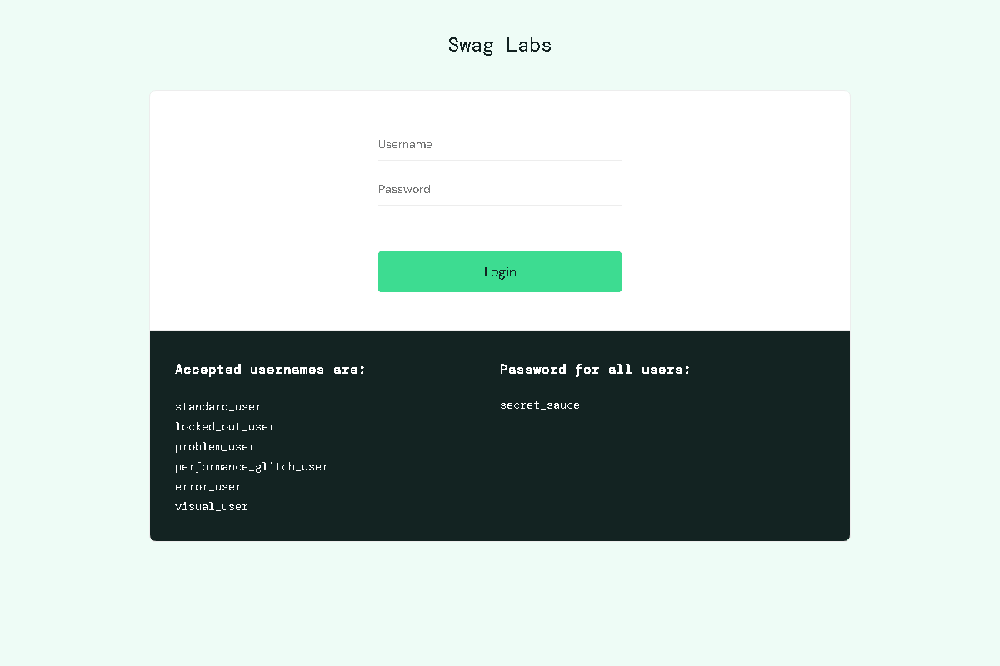

# ecommerce-playwright-tests


Automated E2E tests for a demo e-commerce using Playwright, TypeScript and Node.js.

This repository is a portfolio-ready QA automation project that shows a real
end-to-end flow and clean test architecture.

## Overview

This project covers the main flows for the Sauce Demo web app (`https://www.saucedemo.com/`):
- Login
- Invalid login
- Product add/remove
- Cart validation
- Checkout
- Logout

## Technology stack

- Playwright
- TypeScript
- Node.js
- npm
- Faker (`@faker-js/faker`)
- dotenv
- ESLint
- GitHub Actions

## Project structure

- `tests/` - test suites
- `pages/` - Page Object Models
- `fixtures/` - test data and user credentials
- `utils/` - constants and helpers
- `playwright.config.ts` - Playwright configuration
- `package.json` - scripts and dependencies
- `.env` - environment variables
- `README.md` - project documentation

## Test coverage

- ✔ Valid login
- ✔ Invalid login
- ✔ Add product
- ✔ Remove product
- ✔ Complete checkout flow
- ✔ Logout
- ✔ Page Object Model
- ✔ Fixtures
- ✔ Playwright reports

## Getting started

```bash
npm install
npx playwright install
npm test
```

## Scripts

- `npm test` - run Playwright tests
- `npm run test:headed` - run tests with browser UI
- `npm run test:report` - generate HTML report
- `npm run lint` - run ESLint
- `npm run generate:gif` - generate a sample test run GIF into `assets/test-run.gif`

## Notes for portfolio

This repository is designed to show a professional QA automation project with:
- structured Page Objects
- reusable fixtures
- environment variables
- CI workflow
- error-handling reports
- automated browser report generation

## GitHub Actions

A CI workflow is included to run tests on every push:
- `npm install`
- `npx playwright install`
- `npm test`

## Report

After test execution, open the HTML report with:

```bash
npx playwright show-report
```

## Visual assets

This repository includes a sample animated GIF generated from Playwright screenshots.
Run `npm run generate:gif` to refresh `assets/test-run.gif` with a new example of the test flow.
This is useful to show a working automation demo in your portfolio.



## Recommended improvements

- Replace the GitHub Actions badge placeholder with your real repo path.
- Customize `assets/test-run.gif` with a generated or recorded execution.
- Add test report screenshots or Playwright video captures to improve the presentation.

## What this project demonstrates

- End-to-end automation with Playwright
- Page Object Model architecture
- Environment configuration with `.env`
- Fixtures for test data management
- Parallelizable, maintainable TypeScript tests
- CI automation with GitHub Actions
